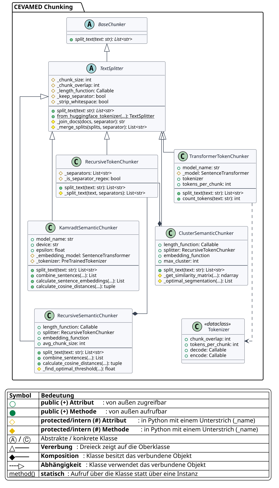
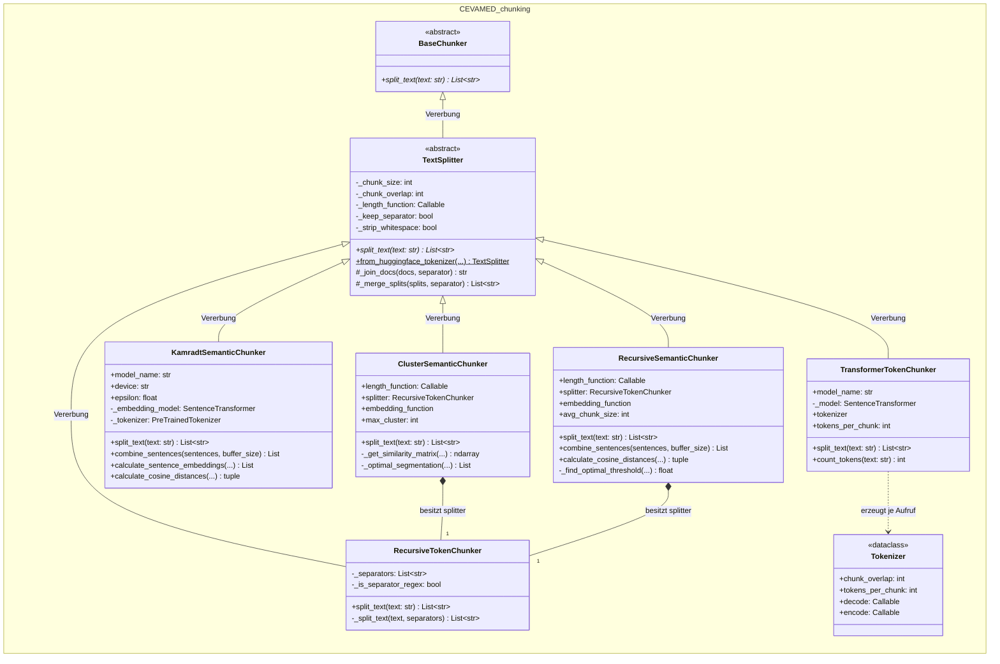

# Klassendiagramm des Chunking-Pakets

Das Diagramm zeigt die statische Struktur der Klassen in `src/chunking`. Das
Hochformat ist für die Darstellung auf einer einzelnen LaTeX-Seite optimiert.

Die exportierten Bilddateien werden aus der PlantUML-Quelle
`chunking_class_diagram.puml` erzeugt. Der nachfolgende Mermaid-Block dient als
direkt lesbare Dokumentationsquelle in Markdown.

## Leseschlüssel

| Darstellung | Bedeutung im Quellcode |
|---|---|
| `<|--` | Vererbung |
| `*--` | Komposition: Die linke Klasse erzeugt und speichert das Objekt |
| `..>` | Nutzung: Das Objekt wird nur temporär verwendet oder indirekt referenziert |

## Architekturhinweis

Alle fünf konkreten Chunker erben vom projekteigenen `TextSplitter`, der das
abstrakte Interface `BaseChunker` implementiert. `ClusterSemanticChunker` und
`RecursiveSemanticChunker` besitzen zusätzlich jeweils einen
`RecursiveTokenChunker` zur Vorsplittung.

Die freien Hilfsfunktionen wie `split_text_on_tokens` und die Plot-Funktionen
sind bewusst nicht dargestellt, da ein Klassendiagramm Klassen und ihre
strukturellen Beziehungen beschreibt.